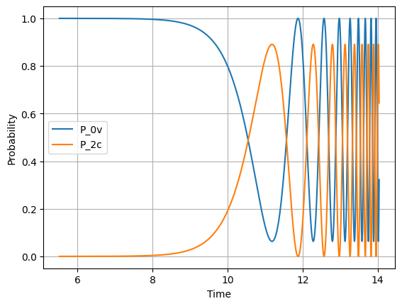
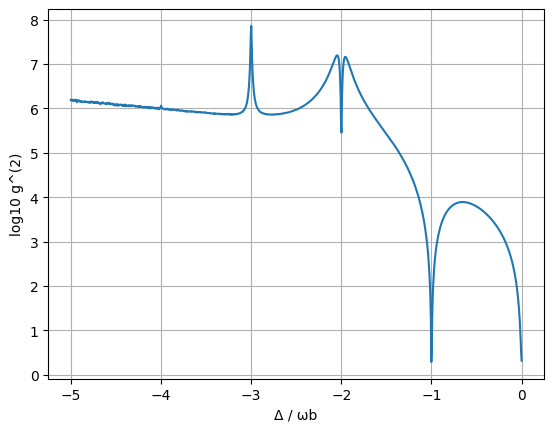
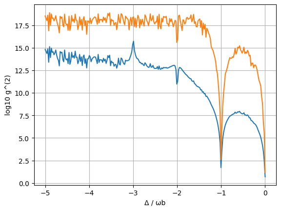
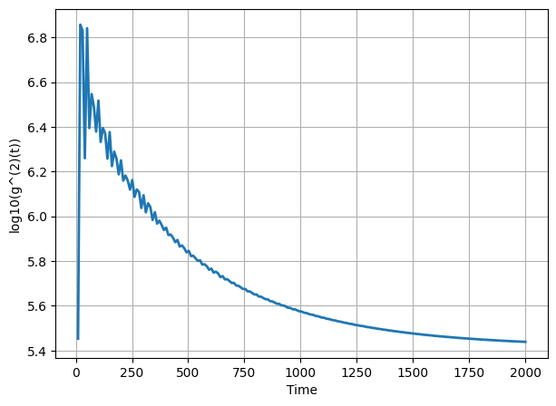

# Phonon Bundle Project Tools 1

First repository in a series exploring the simulation of periodically emitted *n*-phonon bundles. This repository reproduces the results of Phys. Rev. Lett. 124, 053601 (2020) and implements the system model that forms the basis for later stages of the project.

## Overview

The goal of the broader project is to study systems capable of periodically emitting phonon bundles containing a fixed number of phonons. Before extending the model, the results of the reference paper are reproduced as a validation step.

This repository contains implementations for:

* Coherent (non-dissipative) dynamics of 2- and 3-phonon bundle systems.
* Steady-state second-order correlation calculations for different bundle sizes.
* A Lindblad master-equation implementation including dissipation.

## Repository Contents

### Rabi Oscillations

Reproduces the coherent dynamics presented in the reference work by simulating the time evolution of state populations.

Results include:

* P_0v and P_2c populations for the 2-phonon bundle system.
* P_0v and P_3c populations for the 3-phonon bundle system.

  
  

These simulations demonstrate the expected Rabi oscillations in the absence of dissipation.

### Steady-State Correlation Functions

Computes the steady-state second-order correlation function g^2(0) for different bundle sizes.

Results are shown for: n=2,3,4

  
  

and reproduce the behaviour reported in the reference paper.

### Lindblad Master Equation Implementation

Contains a scratch implementation of the Lindblad master equation for a five-emitter system. It uses the Liouvillian superoperator and superket method for faster computation of steady state [2].

  

Features:

* Construction of the Liouvillian superoperator.
* Dissipative evolution of the density matrix.
* Calculation of second-order correlation functions.
* Time evolution over 2000 timesteps.

This implementation served as an initial verification of the dissipative dynamics required for subsequent stages of the project and as an exploration of the physics behind the modelled system.

## References

[1] "N-Phonon Bundle Emission via the Stokes Process" *Physical Review Letters* **124**, 053601 (2020). DOI: https://doi.org/10.1103/PhysRevLett.124.053601

[2] "Variational Renormalization Group for Dissipative Spin-Cavity Systems: Periodic Pulses of Nonclassical Photons from Mesoscopic Spin Ensembles," *Physical Review Letters* **121**, 133601 (2018). DOI: https://doi.org/10.1103/PhysRevLett.121.133601
